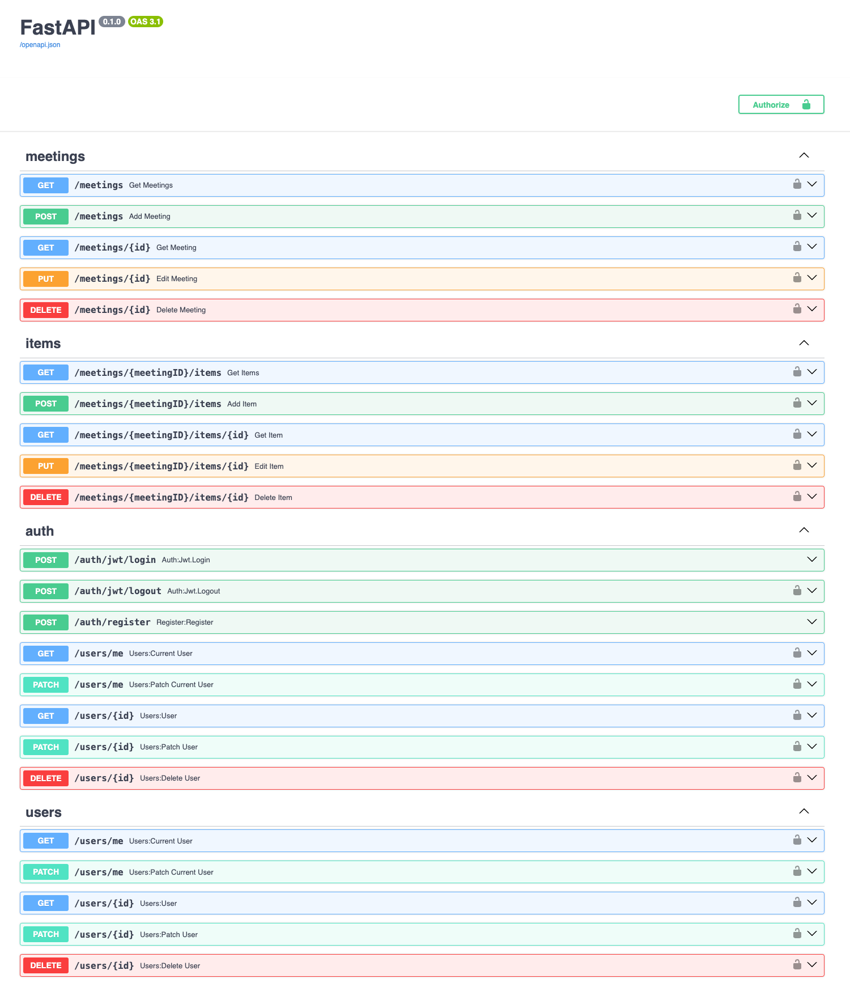

# Meeting note taker API

## General info
This API is designed to assist you in transcribing your audio files, such as those from meetings or note-taking during meetings. It leverages Whisper AI to provide transcription services in multiple languages. This API is implemented using the Unit of Work design pattern.

* Users can registration and authentication;
* Users can create a "meeting". User have permission only for yourself meeting;
* Users can create meeting "item" (upload audio file and description). The application will automatically transcribe your audio files into text;
* Users can list, update and delete their "item", "meeting";

## Technologies
* Python
* FastAPI
* Whisper AI
* redis
* Celery
* Flower
* SQLAlchemy
* PostgreSQL
* alembic
* Pydantic
* Pytest